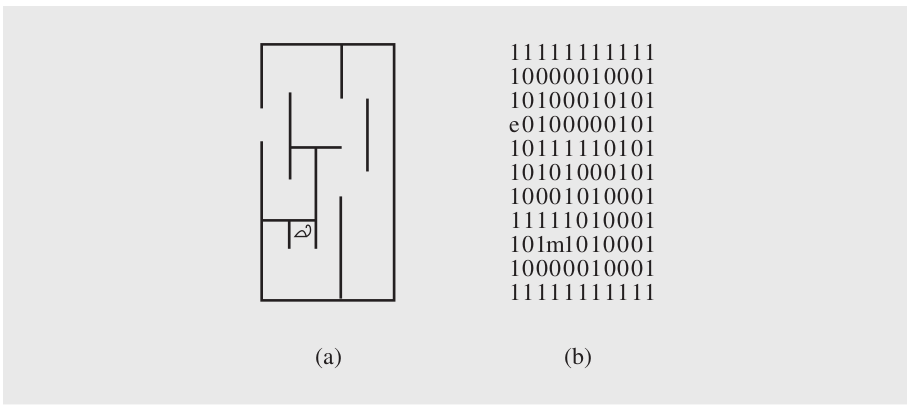

# 4.8 Case Study: Exiting a Maze

Consider the problem of a trapped mouse that tries to find its way to an exit in a maze (Figure 4.22a). The mouse hopes to escape from the maze by systematically trying all the routes. If it reaches a dead end, it retraces its steps to the last position and begins at least one more untried path. For each position, the mouse can go in one of four directions: right, left, down, up. Regardless of how close it is to the exit, it always tries the
open paths in this order, which may lead to some unnecessary detours. By retaining information that allows for resuming the search after a dead end is reached, the mouse uses a method called *backtracking*. This method is discussed further in the next chapter.

The maze is implemented as a two-dimensional character array in which passages are marked with 0s, walls by 1s, exit position by the letter e, and the initial position of the mouse by the letter m (Figure 4.22b). In this program, the maze problem is slightly generalized by allowing the exit to be in any position of the maze (picture the exit position as having an elevator that takes the mouse out of the trap) and allowing passages to be on the borderline. To protect itself from falling off the array by trying to continue its path when an open cell is reached on one of the borderlines, the mouse also has to constantly check whether it is in such a borderline position or not.

**FIGURE 4.22** (a) A mouse in a maze; (b) two-dimensional character array representing the situation.


To avoid it, the program automatically puts a frame of 1s around the maze entered by the user.

The program uses two stacks: one to initialize the maze and another to implement backtracking.

The user enters a maze one line at a time. The maze entered by the user can have any number of rows and any number of columns. The only assumption the program makes is that all rows are of the same length and that it uses only these characters: any number of 1s, any number of 0s, one e, and one m. The rows are pushed on the stack `mazeRows` in the order they are entered after attaching one 1 at the beginning and one 1 at the end. After all rows are entered, the size of the array store can be determined, and then the rows from the stack are transferred to the array.

A second stack, `mazeStack`, is used in the process of escaping the maze. To remember untried paths for subsequent tries, the positions of the untried neighbors of the current position (if any) are stored on a stack and always in the same order, first upper neighbor, then lower, then left, and finally right. After stacking the open avenues on the stack, the mouse takes the topmost position and tries to follow it by first
storing untried neighbors and then trying the topmost position, and so forth, until it reaches the exit or exhausts all possibilities and finds itself trapped. To avoid falling into an infinite loop of trying paths that have already been investigated, each visited position of the maze is marked with a period.

Here is a pseudocode of an algorithm for escaping a maze:

```
exitMaze()
    initialize stack, exitCell, entryCell, currentCell = entryCell;
    while currentCell is not exitCell
        mark currentCell as visited;
        push onto the stack the unvisited neighbors of currentCell;
        if stack is empty
             failure;
        else pop off a cell from the stack and make it currentCell;
    success;
```

The stack stores coordinates of positions of cells. This could be done, for instance, by using two integer stacks for x and y coordinates. Another possibility is to use one integer stack with both coordinates stored in one integer variable with the help of the shifting operation. In the program in Figure 4.24, a class `MazeCell` is used with two data fields, `x` and `y`, so that one mazeStack is used for storing `MazeCell` objects.

Consider an example shown in Figure 4.23. The program actually prints out the
maze after each step made by the mouse.

**0.** After the user enters the maze

    ````
    1100
    000e
    00m1
    ```

the maze is immediately surrounded with a frame of 1s

    ```
    111111
    111001
    1000e1
    100m11
    111111
    ```

`entryCell` and `currentCell` are initialized to `(3 3)` and `exitCell` to `(2 4)` (Figure 4.23a).

1. Because `currentCell` is not equal to `exitCell`, all four neighbors of the current cell `(3 3)` are tested, and only two of them are candidates for processing, namely, `(3 2)` and `(2 3)`; therefore, they are pushed onto the stack. The stack is checked to see whether it contains any position, and because it is not empty, the topmost position `(3 2)` becomes current (Figure 4.23b).

2. `currentCell` is still not equal to `exitCell`; therefore, the two viable options accessible from `(3 2)` are pushed onto the stack, namely, positions `(2 2)` and `(3 1)`. Note that the position holding the mouse is not included in the stack. After the current position is marked as visited, the situation in the maze is as in Figure 4.23c. Now, the topmost position, `(3 1)`, is popped off the stack, and it be comes the value of `currentCell`. The process continues until the exit is reached, as shown step by step in Figure 4.23d–f.

Note that in step four (Figure 4.23d), the position `(2 2)` is pushed onto the stack, although it is already there. However, this poses no danger, because when the second instance of this position is popped from the stack, all the paths leading from this position have already been investigated using the first instance of this position on the stack. Note also that the mouse makes a detour, although there is a shorter path from its initial position to the exit.

[main.cpp](main.cpp) contains code implementing the maze exiting algorithm. Note that the program defines a class `Stack` derived from stack. `Stack` inherits from `stack` all the member functions, but it redefines `pop()` so that a call to a new `pop()` results in both removing the top element from the stack and returning it to the caller.

**FIGURE 4.23** An example of processing a maze.

